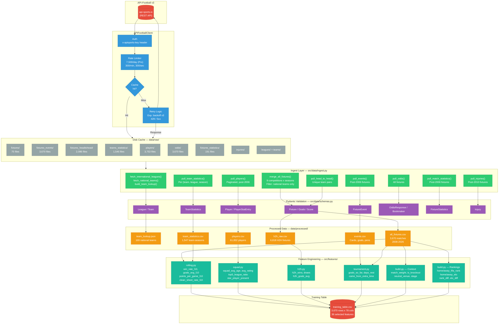
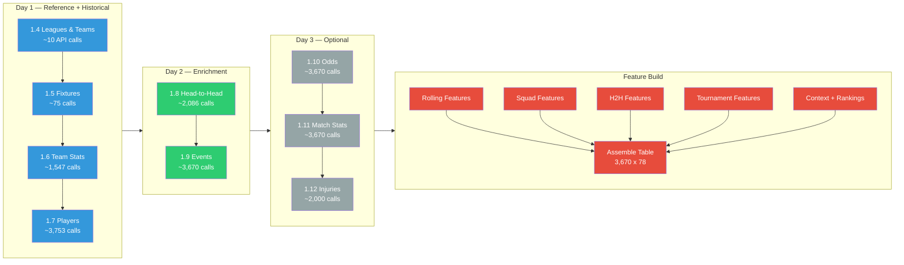
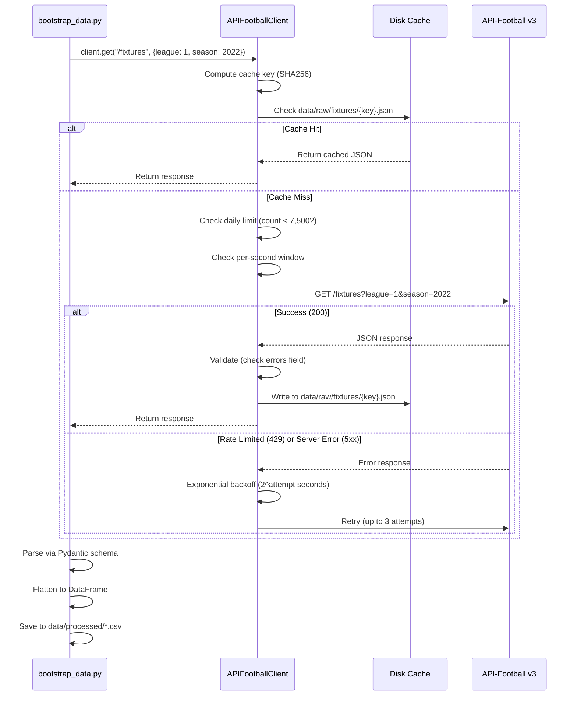
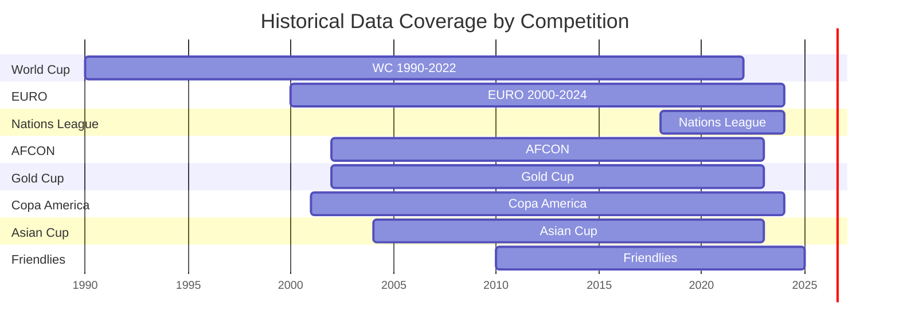

# Data Ingestion Pipeline — Technical Diagram

## High-Level Architecture

```mermaid
flowchart TB
    subgraph SOURCE["API-Football v3"]
        API[("api-sports.io\n(REST API)")]
    end

    subgraph CLIENT["APIFootballClient"]
        direction TB
        AUTH["Auth\nx-apisports-key header"]
        RL["Rate Limiter\n7,500/day (Pro)\n300/min, 300/sec"]
        RETRY["Retry Logic\nExp. backoff x3\n429 / 5xx"]
        CACHE_CHECK{"Cache\nhit?"}
    end

    subgraph CACHE["Disk Cache — data/raw/"]
        direction TB
        C_FIX["fixtures/\n75 files"]
        C_EVT["fixtures_events/\n3,670 files"]
        C_H2H["fixtures_headtohead/\n2,086 files"]
        C_STATS["teams_statistics/\n1,546 files"]
        C_PLAY["players/\n3,753 files"]
        C_ODDS["odds/\n3,670 files"]
        C_MSTAT["fixtures_statistics/\n191 files"]
        C_INJ["injuries/"]
        C_REF["leagues/ + teams/"]
    end

    subgraph INGEST["Ingest Layer — src/data/ingest.py"]
        direction TB
        I_REF["fetch_international_leagues()\nfetch_national_teams()\nbuild_team_lookup()"]
        I_FIX["merge_all_fixtures()\n9 competitions x seasons\nFilter: national teams only"]
        I_STATS["pull_team_statistics()\nPer (team, league, season)"]
        I_PLAY["pull_players()\nPaginated, post-2006"]
        I_H2H["pull_head_to_head()\nUnique team pairs"]
        I_EVT["pull_events()\nPost-2006 fixtures"]
        I_ODDS["pull_odds()\nAll fixtures"]
        I_MSTAT["pull_match_statistics()\nPost-2006 fixtures"]
        I_INJ["pull_injuries()\nPost-2010 fixtures"]
    end

    subgraph SCHEMA["Pydantic Validation — src/data/schemas.py"]
        S1["League / Team"]
        S2["Fixture / Goals / Score"]
        S3["TeamStatistics"]
        S4["Player / PlayerStatEntry"]
        S5["FixtureEvent"]
        S6["OddsResponse / Bookmaker"]
        S7["FixtureStatistics"]
        S8["Injury"]
    end

    subgraph PROCESSED["Processed Data — data/processed/"]
        direction TB
        P_LOOKUP["team_lookup.json\n169 national teams"]
        P_FIX["all_fixtures.csv\n3,670 matches\n2008-2026"]
        P_STATS["team_statistics.csv\n1,547 team-seasons"]
        P_PLAY["players.csv\n61,832 players"]
        P_H2H["h2h_raw.csv\n6,818 H2H fixtures"]
        P_EVT["events.csv\nCards, goals, pens"]
    end

    subgraph FEATURES["Feature Engineering — src/features/"]
        direction TB
        F_ROLL["rolling.py\nwin_rate_l10, goals_avg_l10\npoints_per_game_l10\nclean_sheet_rate_l10"]
        F_SQUAD["squad.py\nsquad_avg_age, avg_rating\ntop5_league_ratio\nstar_player_present"]
        F_H2H["h2h.py\nh2h_wins, draws\nh2h_goals_avg"]
        F_TOURN["tournament.py\ngoals_so_far, days_rest\ncame_from_extra_time"]
        F_CTX["build.py — Context\nmatch_weight, is_knockout\nneutral_venue, stage"]
        F_RANK["build.py — Rankings\nhome/away_fifa_rank\nhome/away_elo\nrank_diff, elo_diff"]
    end

    subgraph OUTPUT["Training Table"]
        TT[("training_table.csv\n3,670 rows x 78 cols\n36 selected features")]
    end

    %% Flow: API to Client
    API --> AUTH
    AUTH --> RL
    RL --> CACHE_CHECK
    CACHE_CHECK -- "Miss" --> RETRY
    RETRY --> API
    CACHE_CHECK -- "Hit" --> CACHE

    %% Cache write-back
    RETRY -- "Response" --> CACHE

    %% Cache to Ingest
    CACHE --> INGEST

    %% Ingest through Schema validation
    I_REF --> S1
    I_FIX --> S2
    I_STATS --> S3
    I_PLAY --> S4
    I_H2H --> S2
    I_EVT --> S5
    I_ODDS --> S6
    I_MSTAT --> S7
    I_INJ --> S8

    %% Schema to Processed
    S1 --> P_LOOKUP
    S2 --> P_FIX
    S3 --> P_STATS
    S4 --> P_PLAY
    S2 --> P_H2H
    S5 --> P_EVT

    %% Processed to Features
    P_FIX --> F_ROLL
    P_FIX --> F_CTX
    P_FIX --> F_RANK
    P_STATS --> F_ROLL
    P_PLAY --> F_SQUAD
    P_H2H --> F_H2H
    P_EVT --> F_TOURN
    P_FIX --> F_TOURN

    %% Features to Training Table
    F_ROLL --> TT
    F_SQUAD --> TT
    F_H2H --> TT
    F_TOURN --> TT
    F_CTX --> TT
    F_RANK --> TT

    %% Styling
    classDef source fill:#e74c3c,color:#fff,stroke:#c0392b
    classDef client fill:#3498db,color:#fff,stroke:#2980b9
    classDef cache fill:#95a5a6,color:#fff,stroke:#7f8c8d
    classDef ingest fill:#2ecc71,color:#fff,stroke:#27ae60
    classDef schema fill:#9b59b6,color:#fff,stroke:#8e44ad
    classDef processed fill:#f39c12,color:#fff,stroke:#e67e22
    classDef features fill:#1abc9c,color:#fff,stroke:#16a085
    classDef output fill:#e74c3c,color:#fff,stroke:#c0392b

    class API source
    class AUTH,RL,RETRY,CACHE_CHECK client
    class C_FIX,C_EVT,C_H2H,C_STATS,C_PLAY,C_ODDS,C_MSTAT,C_INJ,C_REF cache
    class I_REF,I_FIX,I_STATS,I_PLAY,I_H2H,I_EVT,I_ODDS,I_MSTAT,I_INJ ingest
    class S1,S2,S3,S4,S5,S6,S7,S8 schema
    class P_LOOKUP,P_FIX,P_STATS,P_PLAY,P_H2H,P_EVT processed
    class F_ROLL,F_SQUAD,F_H2H,F_TOURN,F_CTX,F_RANK features
    class TT output
```

## Pipeline Execution Order

```mermaid
flowchart LR
    subgraph DAY1["Day 1 — Reference + Historical"]
        direction TB
        S1["1.4 Leagues & Teams\n~10 API calls"]
        S2["1.5 Fixtures\n~75 calls"]
        S3["1.6 Team Stats\n~1,547 calls"]
        S4["1.7 Players\n~3,753 calls"]
        S1 --> S2 --> S3 --> S4
    end

    subgraph DAY2["Day 2 — Enrichment"]
        direction TB
        S5["1.8 Head-to-Head\n~2,086 calls"]
        S6["1.9 Events\n~3,670 calls"]
        S5 --> S6
    end

    subgraph DAY3["Day 3 — Optional"]
        direction TB
        S7["1.10 Odds\n~3,670 calls"]
        S8["1.11 Match Stats\n~3,670 calls"]
        S9["1.12 Injuries\n~2,000 calls"]
        S7 --> S8 --> S9
    end

    subgraph BUILD["Feature Build"]
        direction TB
        F1["Rolling Features"]
        F2["Squad Features"]
        F3["H2H Features"]
        F4["Tournament Features"]
        F5["Context + Rankings"]
        F6["Assemble Table\n3,670 x 78"]
        F1 & F2 & F3 & F4 & F5 --> F6
    end

    DAY1 --> DAY2 --> DAY3 --> BUILD

    classDef day1 fill:#3498db,color:#fff
    classDef day2 fill:#2ecc71,color:#fff
    classDef day3 fill:#95a5a6,color:#fff
    classDef build fill:#e74c3c,color:#fff

    class S1,S2,S3,S4 day1
    class S5,S6 day2
    class S7,S8,S9 day3
    class F1,F2,F3,F4,F5,F6 build
```

## API Client Request Flow

```mermaid
sequenceDiagram
    participant Script as bootstrap_data.py
    participant Client as APIFootballClient
    participant Cache as Disk Cache
    participant API as API-Football v3

    Script->>Client: client.get("/fixtures", {league: 1, season: 2022})
    Client->>Client: Compute cache key (SHA256)
    Client->>Cache: Check data/raw/fixtures/{key}.json
    
    alt Cache Hit
        Cache-->>Client: Return cached JSON
        Client-->>Script: Return response
    else Cache Miss
        Client->>Client: Check daily limit (count < 7,500?)
        Client->>Client: Check per-second window
        Client->>API: GET /fixtures?league=1&season=2022
        
        alt Success (200)
            API-->>Client: JSON response
            Client->>Client: Validate (check errors field)
            Client->>Cache: Write to data/raw/fixtures/{key}.json
            Client-->>Script: Return response
        else Rate Limited (429) or Server Error (5xx)
            API-->>Client: Error response
            Client->>Client: Exponential backoff (2^attempt seconds)
            Client->>API: Retry (up to 3 attempts)
        end
    end

    Script->>Script: Parse via Pydantic schema
    Script->>Script: Flatten to DataFrame
    Script->>Script: Save to data/processed/*.csv
```

## Data Coverage

```mermaid
gantt
    title Historical Data Coverage by Competition
    dateFormat YYYY
    axisFormat %Y

    section World Cup
    WC 1990-2022          :1990, 2022

    section EURO
    EURO 2000-2024        :2000, 2024

    section Nations League
    Nations League        :2018, 2024

    section AFCON
    AFCON                 :2002, 2023

    section Gold Cup
    Gold Cup              :2002, 2023

    section Copa America
    Copa America          :2001, 2024

    section Asian Cup
    Asian Cup             :2004, 2023

    section Friendlies
    Friendlies            :2010, 2025
```
