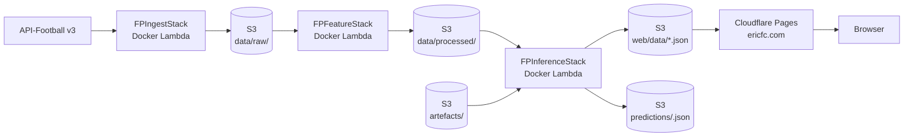
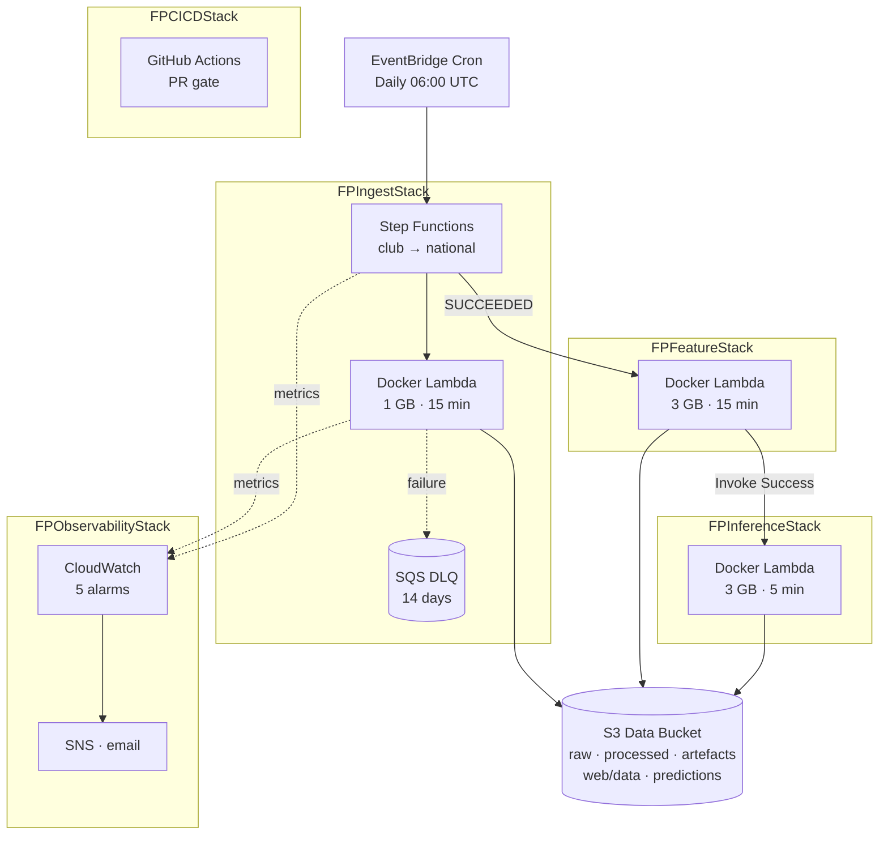

# Technical Architecture — Football Predictions

End-to-end production system that predicts national-team and club-football match scorelines using Poisson regression on per-fixture engineered features, with derived outcome probabilities and tournament Monte Carlo simulation. Live at `https://ericfc.com`.

This document covers the six layers of the system — data ingestion, data processing, model training, inference, MLOps, and front-end — and justifies each major technology choice against the alternatives that were considered.

---

## 1. End-to-end overview



The data pipeline is **one-way and event-driven**. EventBridge fires the daily ingest at 06:00 UTC; ingest's Step Functions success event triggers the feature-engineering Lambda; that Lambda's success event triggers the inference Lambda. There is no API server in the runtime serving path — the Angular dashboard reads pre-rendered JSON files from S3 via Cloudflare's edge.

| Decision | Choice | Rationale |
|---|---|---|
| Backend language | **Python 3.11+** | The whole pipeline is ML/data work — sklearn, XGBoost, LightGBM, SHAP, pandas, Optuna, AWS SDK are first-class. Going polyglot for the API or features would force ser/de boundaries with no benefit. |
| Data store | **S3-only (JSON + Parquet)** | The only writers are scheduled Lambdas; reads are batch and append-only. A relational store (Postgres/RDS) would add operational surface (snapshots, IAM, VPC peering, idle costs) for no gain at this scale. `pyproject.toml` still pins `psycopg2-binary`/`sqlalchemy` from earlier planning, but no schema or migrations exist — JSON-on-S3 is the canonical store. |
| Orchestration | **EventBridge + Step Functions (only for ingest)** | Ingest needs sequential domain calls to respect the API rate limit, so Step Functions earns its keep there. Feature → inference is a 1:1 chain with no fan-out, so a Step Functions definition for it would be ceremony. EventBridge "Lambda success" events are sufficient. Airflow / Dagster were ruled out — too heavy for three Lambdas. |
| IaC | **AWS CDK (Python)** | Same language as the application code, type-safe high-level constructs (e.g. `s3.Bucket(enforce_ssl=True)` produces a correct bucket policy). Terraform was a real alternative but would have meant maintaining HCL plus Python; CloudFormation YAML loses static typing. |

---

## 2. Data ingestion

```
src/data/
  api_client.py     rate-limited HTTP client + disk cache
  ingest.py         endpoint orchestration, raw-JSON storage
  storage.py        S3/local backend abstraction
  schemas.py        Pydantic models for API responses
```

**Source — API-Football v3.** Single upstream covering 1,200+ leagues, all national teams, complete fixture metadata (lineups, events, statistics, head-to-head, injuries, odds). The alternative (multi-source aggregation across StatsBomb, Football-Data.org, FBref) would require schema reconciliation and join validation for every match — material engineering cost for marginal extra coverage.

**Rate limiting and retry.** `api_client.py` enforces per-second / per-minute / daily ceilings keyed off the configured plan (`API_FOOTBALL_PLAN=pro` → 7,500/day). HTTP 429 and 5xx responses retry with exponential backoff (base 2.0s, max 3 attempts). Quota-remaining headers are emitted as a CloudWatch metric so the observability stack can alarm before the daily ceiling is hit.

**What gets pulled.**
- **Reference data:** leagues, teams (seven major tournaments seed the team table).
- **Historical fixtures:** national tournaments going back to 1990 (World Cup, EURO, Nations League, AFCON, Copa America, Gold Cup, Asian Cup), friendlies from 2010, and current-season club fixtures for Premier League, La Liga, Ligue 1.
- **Per-fixture details:** team statistics, player squads, events, H2H, betting odds, injuries.

**Storage.** Raw API responses are written verbatim to `s3://<data-bucket>/data/raw/{national,club}/...` — one file per endpoint call, immutable. The 60-day lifecycle rule transitions older raw data to S3 Infrequent Access automatically. Keeping raw responses (rather than only the parsed/projected form) costs almost nothing and means future feature ideas don't require re-pulling.

**Schedule.** EventBridge cron `cron(0 6 * * ? *)` fires the Step Functions state machine daily at 06:00 UTC. Step Functions chains *club domain → national domain* sequentially because their respective rate-limit budgets would interfere if run in parallel. A 14-day SQS dead-letter queue catches any Lambda failures.

| Decision | Choice | Rationale |
|---|---|---|
| Compute | **Docker-image Lambda (1 GB / 15 min)** | The dependency tree — `pandas`, `requests`, `pydantic`, `boto3` — exceeds Lambda's 250 MB ZIP layer cap once you add typing extras. Docker images on ECR have a 10 GB limit and the same cold-start profile. |
| Cold-side rate-limit strategy | **Sequential domains, single Lambda** | Two parallel Lambdas would double burst rate and trip 429s. Shaping at the orchestrator layer is simpler than at the Lambda layer. |
| Caching | **Disk cache during local dev only** | In Lambda, every invocation gets a fresh container; caching responses there would waste S3 round-trips. Local-only cache speeds up iteration on feature work. |

---

## 3. Data processing / feature engineering

```
src/features/
  build.py         flat-row assembly, match context
  rolling.py       L5 / L10 form windows
  squad.py         per-(team_id, season) squad quality aggregates
  h2h.py           head-to-head priors with min-3-matches threshold
  tournament.py    in-tournament running stats
  handler.py       Lambda entrypoint orchestrating the five phases
```

**Pipeline.** `FPFeatureStack` is a Docker Lambda triggered by an EventBridge rule that matches `Step Functions Execution Status Change → SUCCEEDED` for the ingest state machine. It runs five feature phases in order, then assembles the training and inference flat-row tables.

**Feature families.**

| Family | What it produces | Leakage guard |
|---|---|---|
| **Rolling** (`rolling.py`) | Per-team, per-match: L5 + L10 windows of GF, GA, W/D/L counts, clean sheets, points, form string | Window includes only matches strictly *before* `match_date`; no leakage even on simultaneous fixtures |
| **Squad quality** (`squad.py`) | Per-(team_id, season): avg age, avg player rating, top-5-league ratio, share of squad rated ≥ 8.0 | Rating threshold `>= 50%` of squad must have ratings to count — partial squads get a `null` not a biased low-N estimate |
| **Head-to-head** (`h2h.py`) | Last meeting outcome, prior win/draw rates between the two teams | `min_meetings = 3`; below that, neutral defaults are used |
| **Tournament running stats** (`tournament.py`) | Within current tournament: matches played, goals, cards, status | Strictly accumulates from prior matches in the same `(league_id, season)` |
| **Match context** (`build.py`) | `is_knockout`, `match_weight` (stage × competition: friendly 0.2 → final 1.0), `neutral_venue`, FIFA ranking by team / match-date | FIFA ranking lookup defaults to 150 when missing, never imputes from the future |

**Outputs.**
- `data/processed/training_table.{csv,parquet}` — ~26k rows for national, with WC 2022 explicitly held out.
- `data/processed/inference_table.parquet` — only fixtures with status in `{NS, TBD}`.
- Per-feature CSV+Parquet pairs for inspection.

**Why two formats.** Parquet is the canonical training input (columnar, compressed). CSV mirrors are kept for `git diff`-able debugging and ad-hoc inspection in Excel/Numbers. The cost is trivial.

**Why the holdout matters.** WC 2022 is reserved as a true out-of-sample tournament. The feature table only contains fixtures `< 2022-11-20`, so even an accidental refit on the full set won't see the holdout. This is the single most important integrity check in the pipeline.

---

## 4. Model training

```
src/models/
  train.py      candidate model fits + holdout evaluation
  evaluate.py   metrics: MAE, RPS, log-loss, Brier, scoreline accuracy
  tune.py       configs (light Optuna usage)
  calibrate.py  bivariate-Poisson rho fit on a held-out 15%
  explain.py    SHAP attribution
  select.py     permutation-importance feature pruning, model picking
  simulate.py   Monte Carlo tournament simulation
```

**Modelling approach — independent Poisson goal models.** The system fits two regressors — one for `home_goals`, one for `away_goals` — and combines them into a 2-D scoreline matrix `P(home=h, away=a)` for `h, a ∈ {0..k}`. Outcome probabilities `P(W/D/L)` are derived by summing the matrix. This is more informative than a 3-class W/D/L classifier: the same outcome distribution can come from very different goal expectations, and downstream consumers (tournament simulation, accuracy diagnostics, scoreline cards on the UI) need the fuller distribution.

**Bivariate Poisson with calibrated correlation `rho`.** Independent Poissons systematically under-predict draws because real-world scorelines are correlated (1-1 happens more than independence implies). `calibrate.py` fits a single scalar `rho ∈ [-0.5, 0.5]` on the last 15% of the training data, minimizing draw-Brier. The diagonal of the scoreline matrix is then up- or down-weighted accordingly. `rho` is saved to `artefacts/rho.json` next to the model pickles.

This is a deliberate middle ground between independent Poissons (too few draws) and Dixon-Coles (low-score adjustment but more fragile fit). Bivariate-with-rho is one knob, easy to interpret, easy to recalibrate.

**Candidate models.**

| Model | Library | Role |
|---|---|---|
| `poisson_linear` | `sklearn.PoissonRegressor` | Linear baseline; interpretable coefficients |
| `xgboost_poisson` | XGBoost (`count:poisson`) | Primary candidate |
| `lightgbm_poisson` | LightGBM (`poisson`) | Primary candidate, faster fits |
| `xgboost_classifier` | XGBoost (`multi:softprob`) | Secondary: direct W/D/L classification for comparison |
| `logistic_regression` | sklearn | Classification baseline |
| FIFA-rank-only Poisson | sklearn | Naive baseline — proves features add lift |
| Mean-goals + majority-class | — | Floor baselines |

**Cross-validation strategy.** `TimeSeriesSplit(n_splits=5)`. Random K-fold is wrong here: the model is a temporal predictor, and shuffling lets future information leak into training folds, inflating CV scores. Time-series CV trains on `[start, t]` and validates on `(t, t+window]`, which mirrors how the model is actually used.

**Sample weighting.** Training rows carry the `match_weight` column (friendly 0.2, qualifying 0.4, group stage 0.8, knockout 1.0). The optimizer uses these as `sample_weight`, so a 10-0 friendly thrashing gets less influence than a 1-0 World Cup quarter-final.

**Hyperparameter tuning.** Configs are mostly hard-coded with sensible defaults (depth 5, 500 trees, early stopping on a held-out 20% of train). Optuna is wired in `tune.py` but used sparingly — the dataset is small enough that aggressive tuning overfits the holdout.

**Feature selection.** Permutation importance via `select.py`: features with negative importance (i.e. shuffling them *improves* validation loss) are dropped. `_NATIONAL_DROP_FEATURES` in `train.py` lists the features that consistently scored < 0.002 SHAP value across CV runs.

**Artefacts.** Saved per-mode under `artefacts/` (national) and `artefacts/club/`:
- `model_final_home.pkl`, `model_final_away.pkl`
- `model_final_scaler.pkl` (only if a scaled model was selected)
- `rho.json`
- Metadata JSONs with feature lists and training timestamps

The artefact mtime is the source of truth for `model_trained_at` lineage stamping at inference time.

| Decision | Choice | Rationale |
|---|---|---|
| Target | **Two Poisson regressors over goals**, not one classifier over W/D/L | Goals are integer counts, well-modelled by Poisson; the full matrix supports scoreline UI, expected goals, and tournament simulation that classification can't |
| Calibration | **Bivariate Poisson rho**, not Dixon-Coles | One scalar, easy to interpret, easy to recalibrate; Dixon-Coles' low-score adjustment is hard to keep stable |
| CV | **TimeSeriesSplit**, not K-fold | Random shuffling leaks future fixtures into training folds |
| Holdout | **WC 2022 explicit holdout** | A real out-of-sample tournament is the only honest way to estimate WC 2026 performance |

---

## 5. Inference

```
src/inference/
  handler.py    Lambda entrypoint (mode dispatch)
  predict.py    per-mode batch flow + frozen-prediction logic
```

**Trigger.** EventBridge rule matches Lambda `Invoke Result → Success` on the feature Lambda's ARN. Inference reads the latest `inference_table.parquet`, applies the saved model, and writes outputs.

**Frozen-prediction pattern.**

```
For each upcoming fixture f:
  if exists(s3://bucket/predictions/<f.id>.json):
    load it (do not re-predict)
  else:
    predict using current model artefact
    write s3://bucket/predictions/<f.id>.json (immutable)
```

This is the most consequential design choice in the inference layer. **Every fixture is predicted exactly once.** Re-runs of the inference Lambda do not change `predictions/<f.id>.json` for any fixture that's already been predicted. This guarantees:

1. **Honest accuracy reporting.** When the recent-results card shows "we predicted 2-1, actual was 1-1", the displayed prediction is the one that was made *before* kickoff. Without this guarantee, retraining the model would silently rewrite history and inflate apparent accuracy.
2. **Stable lineage.** Each frozen prediction carries `decision_rule_version` (currently `"argmax_v0"`) and `model_trained_at` (ISO timestamp from artefact mtime). When the model retrains or the decision rule changes, only *future* fixtures get the new lineage. `scripts/prediction_lineage_report.py` groups accuracy by lineage bucket so retraining experiments can be evaluated apples-to-apples.

**Output destinations.**

| Path | Visibility | Purpose |
|---|---|---|
| `web/data/competitions.json` | **Public** (Cloudflare Pages) | Competition metadata for the UI's league switcher |
| `web/data/upcoming_<id>.json` | **Public** | Upcoming fixtures with predicted scoreline / outcome / lambdas |
| `web/data/recent_<id>.json` | **Public** | Last 30 days, predictions joined with actuals |
| `web/data/past_<id>.json` | **Public** | Holdout predictions joined with actuals (e.g. WC 2022) |
| `predictions/<fixture_id>.json` | **Private** (S3 perimeter) | Immutable per-fixture frozen predictions with full metadata |
| `outputs/predictions_*.csv/.parquet` | **Private** | Legacy debug-only dumps |

The split between public `web/data/*` and private `predictions/*` is enforced by an S3 bucket policy that grants `s3:GetObject` to `Principal:*` only on the `web/data/*` prefix. Everything else returns 403 to the public internet (verified via direct S3 URL `curl`). The `predict.py` module docstring carries the matching constraint at the write site so future fields are vetted before being added under the public prefix.

**Decision rule.** The current rule (`argmax_v0`) takes the modal scoreline from the matrix as the predicted score and reports outcome probabilities from the marginal sums. There's a known nuance: the *modal scoreline* and the *marginal-argmax outcome* can disagree (e.g. the matrix might have its peak at 1-1 even though the away team has the highest marginal probability). The UI deliberately derives the displayed outcome from the predicted scoreline rather than from the W/D/L marginals to keep the cards internally consistent — this is documented in memory as a known data quirk.

---

## 6. MLOps / infrastructure



**Five CDK stacks.** Each stack maps to a single concern. They were intentionally not collapsed into one mega-stack: this lets `cdk deploy` target a single layer (e.g. `FPFeatureStack`) without touching the data plane.

| Stack | Contents |
|---|---|
| **FPIngestStack** | S3 data bucket (the only S3 bucket — shared by all stacks), Secrets Manager reference for the API-Football key, Docker Lambda, Step Functions chain, EventBridge cron, SQS DLQ. The bucket policy grants public-read on `web/data/*` (encoded in CDK after the Cloudflare migration). |
| **FPFeatureStack** | Docker Lambda (3 GB / 15 min for pandas + pyarrow), EventBridge rule on ingest's `SUCCEEDED` event |
| **FPInferenceStack** | Docker Lambda (3 GB / 5 min for sklearn + LightGBM), EventBridge rule on FeatureStack Lambda's success |
| **FPObservabilityStack** | SNS topic with email subscription, five CloudWatch alarms |
| **FPCICDStack** | GitHub Actions integration |

**The five alarms.**

1. `IngestExecutionFailed` — Step Functions `FailedExecutions > 0`. Catches structural pipeline breakage.
2. `IngestStale` — no execution started in 25 hours. Catches schedule-not-firing failures (EventBridge silently disabled, Lambda concurrency exhausted).
3. `IngestLambdaErrors` — Lambda `Errors > 0`. Catches in-Lambda exceptions even when Step Functions classified the run as successful.
4. `ApiQuotaLow` — API-Football quota-remaining < 20% of the daily ceiling. Early warning before the hard 429 wall.
5. `FixturesIngestedDrop` — < 1 fixture/day per domain. Catches the silent failure mode where Lambda succeeds but the upstream returned empty.

All five fan out to the same SNS topic with email subscription. The user gets paged in their inbox; no PagerDuty integration (excessive for solo-dev scale).

**CI/CD — GitHub Actions PR gate.** `.github/workflows/pr-gate.yml`:
- Python: `ruff check` + `pytest --no-cov`
- CDK: `cdk synth` against all five stacks (ensures infra changes don't break elsewhere)
- UI: `ng build --configuration production` (catches Angular build regressions, including the Cloudflare Pages build path)

Master is branch-protected: direct pushes are blocked; everything goes through PR. CI/CD phases B (per-subsystem auto-deploy), C (SageMaker Model Registry training), and D (multi-env) are parked.

| Decision | Choice | Rationale |
|---|---|---|
| Stack split | **5 stacks, one S3 bucket** | One stack per concern allows targeted deploys; one bucket avoids cross-stack data-bucket-name plumbing |
| Lambda sizing | **3 GB for feature/inference**, 1 GB for ingest | Pandas + sklearn + lightgbm need RAM for the training/inference tables; ingest is mostly I/O |
| Alarm fan-out | **Single SNS topic, email** | Solo dev; PagerDuty / Slack would be ceremony |
| CI/CD | **PR gate only (Phase A)** | Phase B–D deploy automation parked until the project has multi-developer pressure |

---

## 7. Front-end

```mermaid
flowchart LR
    Browser[Browser<br/>ericfc.com] --> CFEdge[Cloudflare Edge<br/>PoP]
    CFEdge -- /* --> StaticAssets[Pages Static<br/>Angular bundle]
    CFEdge -- /data/* --> PagesFn[Pages Function<br/>functions/data/[[path]].js]
    PagesFn --> S3[(S3 web/data/*.json<br/>public-read)]
    PagesFn -. cached .-> CFEdge
```

**Stack.**

| Choice | Justification |
|---|---|
| **Angular 21** (standalone components, strict TS) | Batteries-included routing, HTTP, DI; strong typing; Material Design library available without third-party theming. The alternatives (React, Vue) would each need their own composition of routing and HTTP libraries. |
| **Signals + minimal RxJS** | Angular signals (introduced in v16, mature in v20+) are simpler than full RxJS for component-local state. `home.component.ts` uses `signal()` for `competitions`, `selectedId`, `upcomingMatches`, and `computed()` for derivations. Service-layer HTTP calls still return `Observable` for cancellability. |
| **Static JSON over a live API** | The UI doesn't need any stateful queries — every page renders from a small set of pre-aggregated JSONs. Serving them as static assets through a CDN is cheaper, faster, and removes an entire failure surface (the API server). |
| **Cloudflare Pages** for hosting | Free TLS, free custom domain, GitHub-connected CI/CD, edge cache, and a Pages Function as the `/data/*` proxy. The original AWS CloudFront-fronted plan was blocked on AWS's verification queue and was decommissioned in favor of this. |
| **Pages Function `/data/*` proxy** | Keeps the frontend origin-clean: every request to the SPA hits one origin (`ericfc.com`). No CORS preflight on data fetches, no second hostname to manage. The function transforms `/data/<file>` to `https://<bucket>.s3.eu-west-3.amazonaws.com/web/data/<file>` and caches the response at the edge. |

**The `/data/*` Pages Function** lives at `src/ui/client/functions/data/[[path]].js`. It's a 25-line unauthenticated proxy that relies on the bucket's public-read policy on the `web/data/*` prefix. The S3 bucket name is in the function source, but only the `web/data/*` prefix is publicly readable — `predictions/`, `data/raw/`, `data/processed/`, and `artefacts/` all return 403 to anonymous requests.

**Default-state and persistence.** First-time visitors land on the Premier League view; thereafter the user's selection is persisted in `localStorage` under `ericfc.selectedLeague` and respected on every subsequent load. The default-league constant lives at `home.component.ts:16`.

**The `src/api/` FastAPI app.** Routes for `/health`, `/predictions`, `/teams`, `/simulate` exist and are functional in code, but **not wired into the runtime serving path**. The current UI bypasses it and reads JSONs directly from S3 via the Pages Function. The FastAPI app remains as a fallback / future surface — useful when the data starts to need stateful queries (per-fixture details, ad-hoc tournament-simulation endpoints) that don't fit the static-JSON pattern. It's not dead code, but it's not in the live path either.

---

## 8. Cross-cutting concerns

**Leakage protection (the most important integrity property).**

| Where | Protection |
|---|---|
| Rolling features | Window strictly `< match_date`, never `≤` |
| H2H | Same: strictly prior meetings only |
| Tournament running stats | Accumulates only within `(league_id, season)` and only from prior matches |
| FIFA ranking | Lookup by `(team, match_date)`; defaults to 150 if missing rather than imputing forward |
| Train/holdout split | National: train < 2022-11-20, holdout = WC 2022. Club: train on prior seasons, holdout = most recently completed season |
| Calibration set | Last 15% of train, separate from any test/holdout |
| CV | `TimeSeriesSplit`, never random K-fold |

**Lineage stamping.** Every frozen prediction in `predictions/<fid>.json` carries:
- `decision_rule_version` — currently `"argmax_v0"`. Bumped when the decision rule itself changes.
- `model_trained_at` — ISO timestamp from the artefact `mtime`. Bumped on every retrain.

`scripts/prediction_lineage_report.py` groups accuracy by lineage bucket. This makes "did the new model improve things?" a real, answerable question instead of "did our average accuracy go up over a window that includes both old and new predictions?".

**Public-data perimeter.** The S3 bucket policy has two statements:
1. `DenyInsecureTransport` — auto-generated by CDK's `enforce_ssl=True`. Refuses any request not over HTTPS.
2. `PublicReadWebData` — grants `s3:GetObject` to `Principal:*` scoped to `arn:…/web/data/*` only.

`BlockPublicAccess` is set with `block_public_acls=True, ignore_public_acls=True` (no ACL-based public access ever) but `block_public_policy=False, restrict_public_buckets=False` (so the prefix-scoped policy can take effect). All four bits are encoded in `infrastructure/stacks/ingest_stack.py`; running `cdk diff FPIngestStack` should be a no-op against the live state.

---

## 9. Known gaps and parked work

- **Recent-window drift.** Holdout calibration is fine (within ±7%) but recent fixtures (last 30 days) are systematically under-predicted on totals: PL −15.7%, La Liga −8.4%, Ligue 1 −26.2%. This is drift, not bias — likely fixed by more frequent retraining or down-weighting older seasons.
- **Tournament simulation** (Phase 3.10). Scaffolding in `src/models/simulate.py` (Monte Carlo group + knockout). Not yet exposed in the UI. World Cup 2026 kicks off 2026-06-11.
- **SHAP explainability surfaced in UI.** SHAP values are computed in `src/models/explain.py` but not displayed to end users.
- **Friendlies / aggregate national-team competition.** Open question whether to expose an "All national teams" view.
- **Retrain idempotence on frozen predictions.** Architecturally guaranteed by the frozen-prediction pattern, but not yet covered by an explicit test.
- **CI/CD Phases B–D.** Auto-deploy per stack, SageMaker Model Registry training, multi-environment (dev/prod). All deferred until multi-developer pressure justifies the engineering cost.
